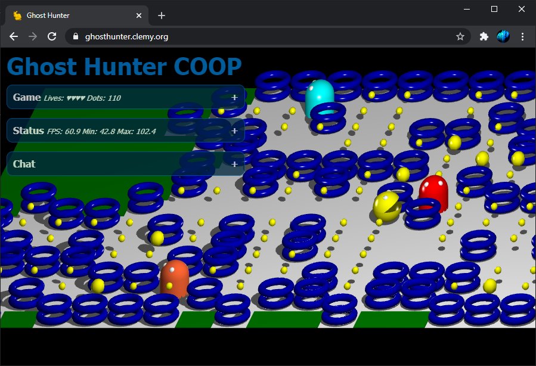

# GhostHunter Coop
GhostHunter Coop is a clone of a well known '80s arcade game extended with 3D and multiplayer support.

**Try it here: <https://ghosthunter.clemy.org/>**



All players start on the same game map playing cooperatively to collect the dots. You can die, but you can not really lose. A new round will start after the last dot has been collected.

## HowTo Run Locally
### Node.js v14
The server needs a Node.js v14 installation as environment. Node.js is available for many platforms.

On Ubuntu you can get it installed with:
```bash
# get Node.js v14 if you do not have it already:

# setup apt repositories
curl -sL https://deb.nodesource.com/setup_14.x | sudo -E bash -
# install nodejs package
sudo apt-get install -y nodejs
# install build-essential for some npm packages
sudo apt-get install -y build-essential
```

### Install dependencies and run the server
After Node.js is installed please execute following commands in the root directory of this package to install the necessary dependencies and run the server:
```bash
# run the game:

# install npm packages
npm install

# start server
node app.mjs

# start your browser and go to http://localhost:4000/
firefox http://localhost:4000/
# or
chrome http://localhost:4000/
```

# Tested Environments
## Server
  * Ubuntu 20.04.1 LTS on
    * Windows Subsystem For Linux 2
    * Raspberry PI 4
  * Node.js v14.15.1

## Client
  * Fully supported platforms:
    * Microsoft Windows 10 Pro 2004 German Language Pack
      * Google Chrome 87.0.4280.66 German
      * Microsoft Edge 87.0.664.41 German
      * Firefox 83.0 (64-Bit) German
    * macOS 10.15.7
      * Safari 14.0.1
  
  * Partial support:  screen layout needs mobile optimization
    * iPhone Xs - iOS 14.2
      * Safari Mobile: use swipe and tap gestures
